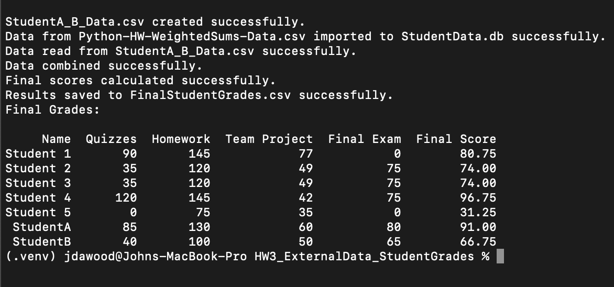

# HW3 External Data Input - Student Grades

This repository contains the solution for **HW3 - Decision Making with External Data Input** from SER 416. It processes student grade data from CSV files and an SQLite database, calculates final scores using a weighted formula, and outputs the results.

## Features
- Automatically generates `StudentA_B_Data.csv` for StudentA and StudentB.
- Imports Student1-3 data from `Python-HW-WeightedSums-Data.csv` into `StudentData.db`.
- Combines data from the database and CSV.
- Calculates final grades with weights:
    - Quizzes: 20%
    - Homework: 30%
    - Team Project: 25%
    - Final Exam: 25%
- Saves final grades to `FinalStudentGrades.csv`.
- Displays final grades in the terminal.

## Setup & Run
1. Clone the repo:
   ```bash
   git clone https://github.com/jdawood1/ExternalDB-Student-Grades
   cd HW3_ExternalData_StudentGrades
   ```

2. Create and activate virtual environment:
   ```bash
   python3 -m venv .venv
   source .venv/bin/activate
   ```

3. Install required packages:
   ```bash
   pip install pandas
   ```

4. Add the provided `Python-HW-WeightedSums-Data.csv` to the root directory.

5. Run the script:
   ```bash
   python Hw3_Student_Grades.py
   ```

## Output Files
- `StudentA_B_Data.csv`
- `StudentData.db`
- `FinalStudentGrades.csv`

## Screenshot
